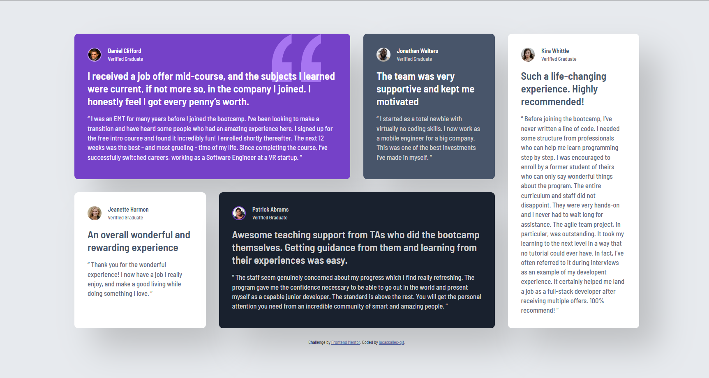
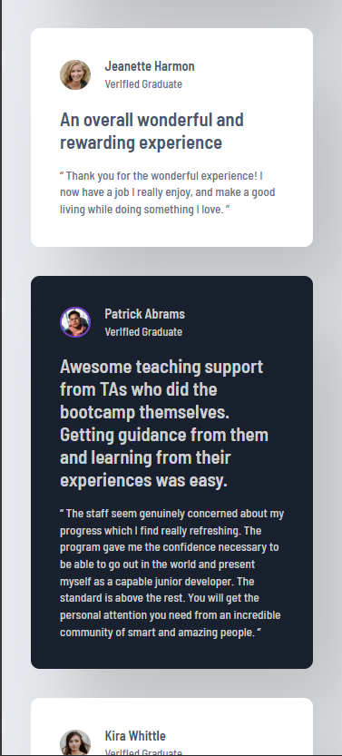

# Frontend Mentor - Testimonials grid section solution

This is a solution to the [Testimonials grid section challenge on Frontend Mentor](https://www.frontendmentor.io/challenges/testimonials-grid-section-Nnw6J7Un7).

## Table of contents

- [Overview](#overview)
  - [The challenge](#the-challenge)
  - [Screenshot](#screenshot)
  - [Links](#links)
- [My process](#my-process)
  - [Built with](#built-with)
  - [What I learned](#what-i-learned)
- [Author](#author)

## Overview

### The challenge

Users should be able to:

- View the optimal layout for the site depending on their device's screen size

### Screenshot





### Links

- Solution URL: [Add solution URL here](https://your-solution-url.com)
- Live Site URL: [Add live site URL here](https://your-live-site-url.com)

## My process

### Built with

- Semantic HTML5 markup
- CSS custom properties
- Flexbox
- CSS Grid
- Mobile-first workflow
- [Sass](https://sass-lang.com/) - For styles

### What I learned

I learned how to position elements using grid-template-areas:

```scss
.testimonials {
  grid-template-columns: repeat(4, 1fr);
  grid-template-rows: auto auto;
  grid-template-areas:
    "daniel daniel jonathan kira"
    "jeanette patrick patrick kira";

  .daniel {
    grid-area: daniel;
  }
  .jonathan {
    grid-area: jonathan;
  }
  .jeanette {
    grid-area: jeanette;
  }
  .patrick {
    grid-area: patrick;
  }
  .kira {
    grid-area: kira;
  }
}
```

## Author

- Frontend Mentor - [@lucassalles-git](https://www.frontendmentor.io/profile/lucassalles-git)
- GitHub - [lucassalles-git](https://github.com/lucassalles-git)
